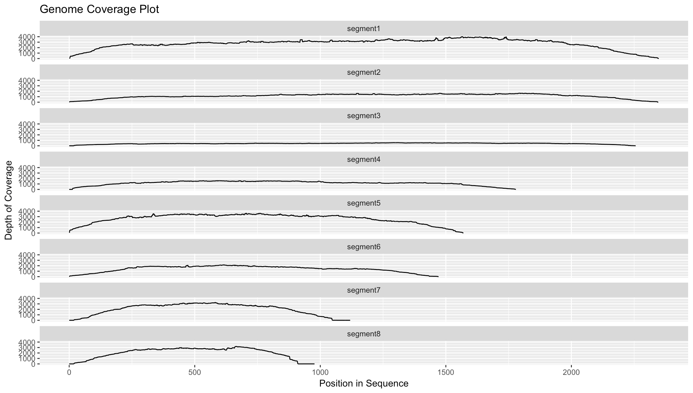

Process Overview
----------------

### FastQC

FastQC is used to evaluate the quality of sequences within each sample. Output from this step is a collection of HTML reports that can be used to visualize different sequence quality control metrics.


### Trimmomatic

Trimmomatic is used to remove adapter sequences and other contaminants and low quality base pairs from the user input sequence data. These sequences can be truncated in the presence of adapter sequences or low quality sequence fragments. Sequences will also be removed if the trimming operations result in a read below a user-defined length. If either read (forward or reverse) is removed, both reads are removed from the forward and reverse file.


### Host DNA Subtraction

Host-DNA subtraction is a general first step in many studies involving pathogen associated datasets. There are two general strategies that are most often cited in the literature: (1) host mapping subtraction using a sequence-based aligner like BWA or Bowtie2 and (2) kmer-based filtering using the unpublished software Kontaminate. This pipeline uses the former strategy with the BWA software package. 

### SPAdes

SPAdes is used to assemble the cleaned FASTQ files from the previous trimming step. Output from this step is a FASTA formatted contigs file containing each of the eight influenza genome segments.


### MegaBlast

MegaBlast is used to annotate each of the genome segments (or contigs) within the assembly file. These annotations are produced using sequences collected from the Influenza Virus Database. This database includes over 500,000 individual sequences for influenza A, B, and C viruses.

```
>gi|662496343|gb|KJ942596|Influenza_A_virus_(A/Indiana/10/2011(H3N2))_segment_8_nuclear_export_protein_(NEP)_and_nonstructural_protein_1_(NS1)_genes,_complete_cds
CGCCAGCGAAAGCAGGGTGACAAAGACATAATGGACTCCAATACTGTGTCAAGTTTTCAG
GTAGACTGTTTCCTTTGGCACATCCGCAAACGGTTTGCAGACAATGGATTGGGTGATGCC
CCATTTCTTGATCGGCTCCGCCGAGATCAAAAGTCCCTAAAAGGAAGAGGCAACACCCTT
GGCCTTGATGTCGAAACTGCCACTCTTGTTGGGAAGCAAATTGTGGAGTGGATTTTGAGA
GAGGAGTCCAGCGAGACACTTAAGATGACCATTGCATCTGTACCTACTTCGCGCTACATA
GCTGACATGACCCTCGAGGAAATGTCACGAGACTGGTTCATGCTCATGCCTAGGCAAAAG
ATAATAGGCCCTCTTTGTGTGCGAATGGATCAGGCGATCATGGAAAAGAACATTATACTG
AAAGCGAACTTCAGTGTGATCTTTAACCGATTAGAGACTTTGATACTACTAAGGGCTTTC
ACTGAGGAGGGAGCAATCGTTGGAGAAATTTCACCATTACCTTCTCTTCCAGGACATAAT
AACGAGGATGTCAAAAATGCAGTTGGGGTCCTCATCGGAGGACTTGAATGGAATGATAAC
ACGGTTCGAGGCTCTGAAAATCTACAGAGATTCGCTTGGAGAAACCGTAATGAGGATGGG
AGACCTTCACTACCTCCAGAGCAGAAATGAAAAGTGGCGAGAGCAATTGGGACAGAAATT
TGAGGAAATAAGGTGGTTAGTTGAAGAAGTACGACACAGATTGAAGGCAACAGAAAATAG
TTTCGAACAAATAACATTTATGCAAGCCTTACAACTACTGCTTGAAGTAGAGCAAGAGAT
AAGGACTTTCTCGTTTCAGCTTATTTAATGATAAAAAACACCCTTGTTTCTACTGGCGC
```

### Bedtools

Bedtools is used to compute genome coverage statistics for each influenza genome segment.



### QUAST

QUAST is used to evaluate different quality metrics for each of the produced genome assemblies.


### MultiQC

MultiQC is a tool that aggregates log files from different bioinformatics tools to create summary plots for each sample. These are used to help summarize the results from different steps of the pipeline (i.e., sequence evaluation, trimming, and assembly).
