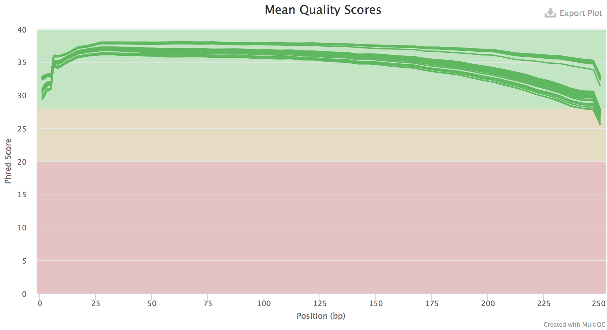
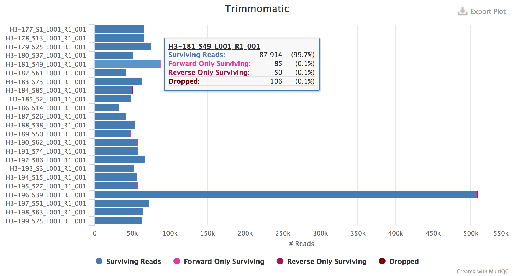
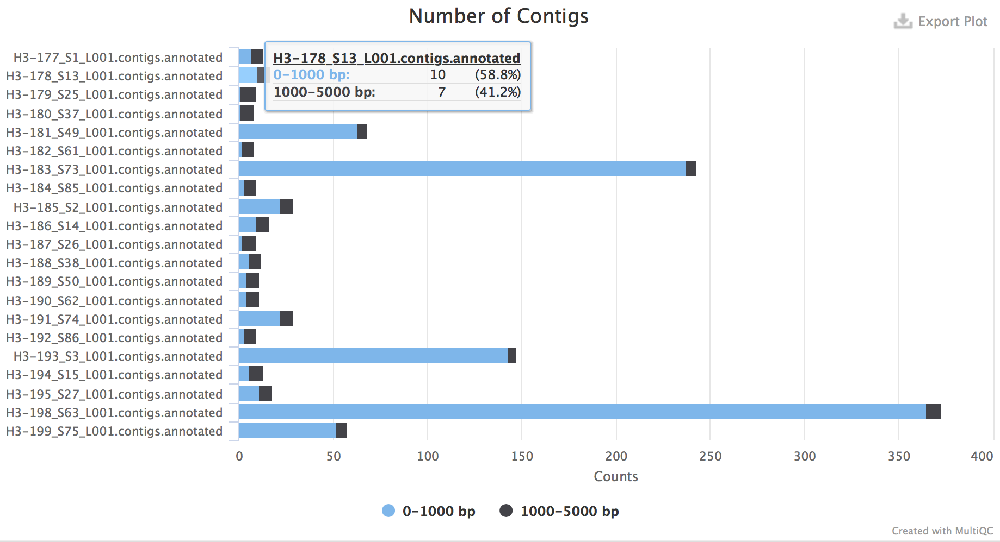
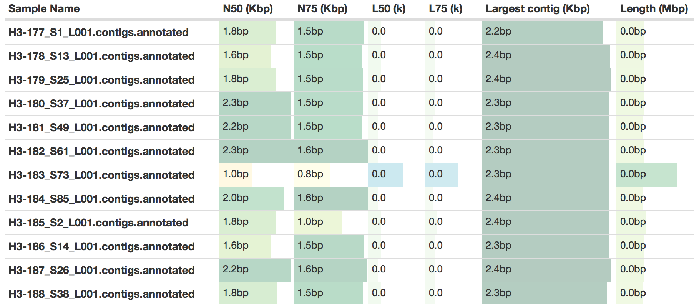

Process Overview
----------------

### FastQC

FastQC is used to evaluate the quality of sequences within each sample. Output from this step is a collection of HTML reports that can be used to visualize different sequence quality control metrics.

### Trimmomatic

Trimmomatic is used to remove adapter sequences and other contaminants and low quality base pairs from the user input sequence data. These sequences can be truncated in the presence of adapter sequences or low quality sequence fragments. Sequences will also be removed if the trimming operations result in a read below a user-defined length. If either read (forward or reverse) is removed, both reads are removed from the forward and reverse file.

### SPAdes

SPAdes is used to assemble the cleaned FASTQ files from the previous trimming step. Output from this step is a FASTA formatted contigs file containing each of the eight influenza genome segments.

### QUAST

QUAST is used to evaluate different quality metrics for each of the produced genome assemblies.

### MultiQC

MultiQC is a tool that aggregates log files from different bioinformatics tools to create summary plots for each sample. These are used to help summarize the results from different steps of the pipeline (i.e., sequence evaluation, trimming, and assembly).
